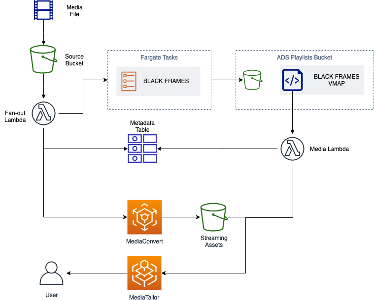

# AWS Elemental MediaTailor - Automatic Ads Profiling - Black Frames


This repository supports the Media Blog article [Monetizing your Media Content with AWS Elemental MediaTailor and Computer Vision](https://aws.amazon.com/blogs/media/monetize-media-content-with-aws-elemental-mediatailor-and-computer-vision/).
  
The goal of this repository is to deploy a minimal pipeline to ingest, analyze
stream, and automatically insert ads in media contents.

## Architecture
  
Architecture of the presented solution. It makes use of [Amazon S3](https://aws.amazon.com/s3/) to store the source, the transcoded contents, and the VMAP files. [Lambda Functions](https://aws.amazon.com/lambda/) are used to start a transcoding job and the analysis tasks on [Amazon ECS](https://aws.amazon.com/ecs/). [Amazon DynamoDB](https://aws.amazon.com/dynamodb/) is used to store metadata. [AWS Elemental MediaConvert](https://aws.amazon.com/mediaconvert/) is used to produce HLS playlists while MediaTailor operates the ads insertion based of the generated VMAP file.


## Repository Structure
```bash
.
├── CODE_OF_CONDUCT.md
├── CONTRIBUTING.md
├── LICENSE
├── README.md
├── assets
│   ├── bbb_short.mp4
│   ├── ffmpeg-blackdetect-sample.txt
│   └── vmap.xml
├── cloudformation
│   ├── dynamodb.yml
│   ├── fanout-lambda.yml
│   ├── inputs.yml
│   ├── main.yml
│   ├── media-lambda.yml
│   ├── tasks.yml
│   └── vpc.yml
├── functions
│   ├── fanout-lambda
│   │   ├── Makefile
│   │   ├── assets
│   │   │   └── event.json
│   │   ├── fanout-lambda.py
│   │   └── jobTemplate.json
│   └── media-lambda
│       ├── Makefile
│       ├── assets
│       │   └── event.json
│       └── media-lambda.py
├── install.sh
├── player
│   ├── README.md
│   ├── deploy.sh
│   ├── env.example
│   └── index.template.html
└── tasks
    └── black-frames
        ├── Dockerfile
        ├── Makefile
        ├── README.md
        ├── task
        │   ├── __init__.py
        │   ├── pyvenv.cfg
        │   ├── task.py
        │   └── utils.py
        └── version.sh

```

**assets/** includes some static files that are used by the deployment script or to run tests.

**cloudformation/** includes all of the templates needed to deploy the solution.  The stack is configured as a nested-stack. All of the components are deployed via the **main.yml** template.

**functions/** includes the code for the lambda functions deployed with the solution:

* **fanout-lambda/** is the function that starts the MediaConvert job, registers the media asset in DynamoDB, and bootstraps the analysis task on Fargate. **fanout-lambda.py** is the script that includes the Lambda handler, while **jobTemplate.json** is the MediaConvert job template that is used by the Lambda Function.
* **media-lambda/** is the function that creates a MediaTailor Campaign and adds the relative metadata to the DynamoDB table.

**player/** includes a minimal html page that allows the user to stream a sample ads-featured HLS stream.  

**tasks/** is the folder that hosts the analysis tasks. At the time of writing, the repositorie only includes **black-frames/**, the task which finds long sequences of black frames within the media asset.

* **config.env** is used by the Makefile to configure the task at runtime. This can be useful to test the task locally.
* **deploy.env** is used by the deployment script to configure the Fargate Task at deployment time. 
* **README.md** provides further information about the task.
* **Dockerfile** configures the Docker container that will be deployed to ECR and used by ECS Fargate to perform the analysis.
* **task/task.py** is the container entrypoint while **task/utils.py** includes utility functions for the task.

**install.sh** is the script that orchestrates the deployment of the AWS infrastructure.


## Deployment
To deploy the stack, create a file named `.env` in the root folder.  
Populate the file with the following 

```bash
STACK_NAME=automatic-ads-profiling-dev
CFN_BUCKET=<insert-cfn-bucket-here>
AWS_DEFAULT_REGION=eu-west-1
ENVIRONMENT_SUFFIX=<your-environment>
```
In a shell, run 
```bash
./install.sh
```

## Acknowledgements

### Big Buck Bunny
**Big Buck Bunny** is a 2008 short, open-source film made by the Blender Institute.  
A short clip of this video has been used to test the end-to-end processing and
it's available in the `./assets` folder.  
Big Buck Bunny is a 2008 &copy; copyright of [Blender Foundation](http://www.bigbuckbunny.org/).

### How does this software make use of FFmpeg?
Code from FFmpeg is made use of in the software in this repository.  
The `ffmpeg` cli tool is invoked via a python script to analyse a video file to find black frames.  
The exact filter used in the analysis is [vf_blackdetect.c](https://github.com/FFmpeg/FFmpeg/blob/release/4.2/libavfilter/vf_blackdetect.c).
FFmpeg is therfore used to decode the video and run the mentioned filter on the decoded frames.  

The exact spot in which the command is invoked is `tasks/black-frames/task/task.py`, lines 38-54. 
The output of the invocation of `ffmpeg` is then parsed to produce a VMAP file.

## License
The content of this repository is released under MIT-0 license.    
You can find more details in the `LICENSE` file.  

## Important Legal Notice
The solution makes use of FFmpeg to analyze the low-level visual features of the uploaded media files.  
**FFmpeg** (https://ffmpeg.org/) is a free and open-source software suite for handling video, audio, 
and other multimedia files and streams. This solution makes use of FFmpeg to analyze the low-level visual 
features of the uploaded media files.  
FFmpeg is distributed under [LGPL license](http://www.gnu.org/licenses/old-licenses/lgpl-2.1.html).  
For more information about FFmpeg, please see the following link: [https://www.ffmpeg.org/](https://www.ffmpeg.org/).  
**Your use of the solution will cause you to use FFmpeg.  If you do not want to make use of FFmpeg, do not use the solution**.


## Security Notice

### About the container used in this solution
This solution builds a contianer that will be hosted on an ECR repository in your AWS account.  
The container is built on the top of [giusedroid/ffmpeg-lgpl-ubuntu](https://hub.docker.com/repository/docker/giusedroid/ffmpeg-lgpl).  
You can inspect the source of said base container [here](https://github.com/giusedroid/ffmpeg-lgpl-ubuntu/blob/master/Dockerfile).  
The container is run on ECS Fargate and you can inspect the IAM role under which it operates [here](/cloudformation/tasks.yml).  
ECR scan on push is activated to inspect the container for known vulnerabilities, 
for more information, please read [this article](https://docs.aws.amazon.com/AmazonECR/latest/userguide/image-scanning.html).

### About S3 buckets used in this solution
This solution crates 3 S3 buckets in your AWS account.  
- an **input bucket** to which you can upload your media files. This bucket and its content are private by default and S3 SSE encryption at rest is enabled.
- an **output bucket** where the HLS segments are uploaded. This bucket and its content are private by default and S3 SSE encryption at rest is enabled. 
- an **ads manifest bucket** where the VMAP XML files are uploaded when the analysis is complete. The bucket is private by default, **but the VMAP XML files are set to be public** so they can be retreived by AWS Elemental MediaTailor.